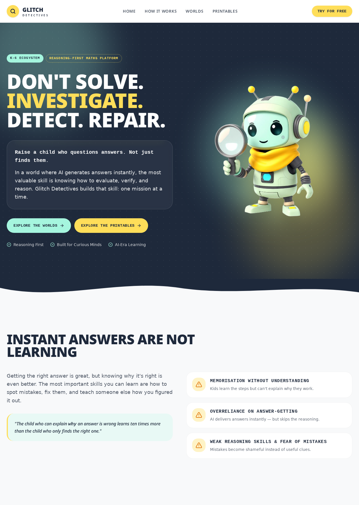
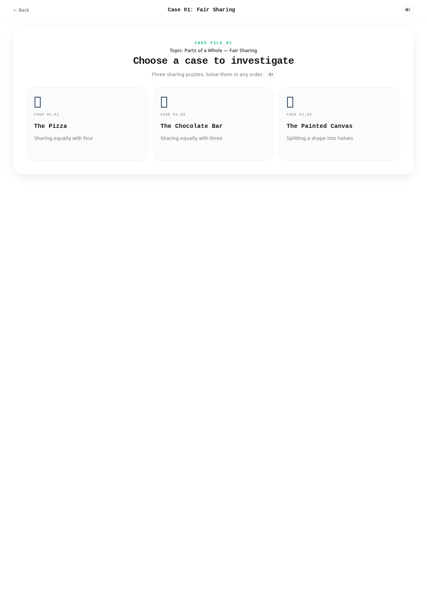
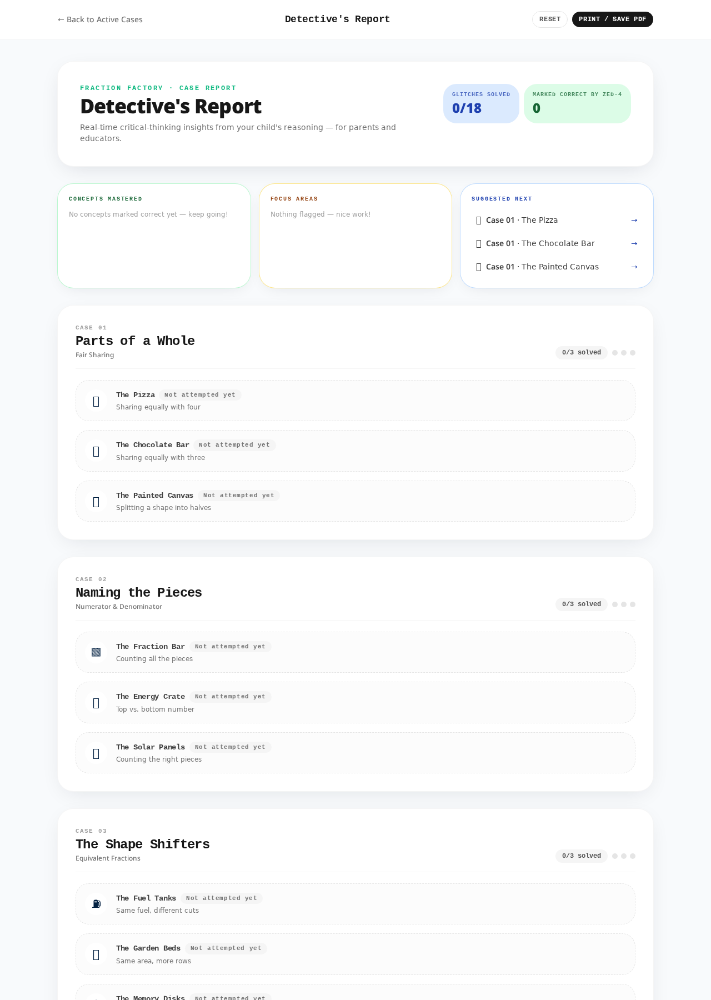
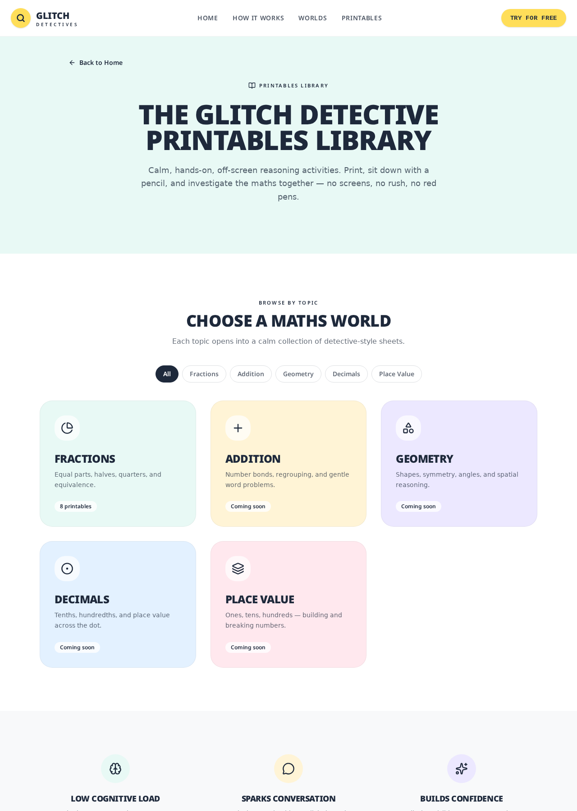

# Glitch Detectives

> **Don't solve. Investigate. Detect. Repair.**
> A reasoning-first maths app for K-6. ZED-4, our AI, confidently gets the answer wrong — the child becomes the detective who finds the glitch, fixes it, and explains why.

**Live:** https://glitchdetectives.lovable.app



---

## Table of contents

1. [Description](#description)
2. [Why it exists](#why-it-exists)
3. [Screenshots](#screenshots)
4. [Prerequisites](#prerequisites)
5. [Installation](#installation)
6. [Usage](#usage)
7. [Architecture overview](#architecture-overview)
8. [Tech stack](#tech-stack)
9. [Project structure](#project-structure)
10. [Development scripts](#development-scripts)
11. [AI output example](#ai-output-example)
12. [Rubric-relevant evidence](#rubric-relevant-evidence)
13. [Security](#security)
14. [Docs](#docs)
15. [Contributing](#contributing)
16. [License](#license)

---

## Description

Glitch Detectives is a browser-based, reasoning-first maths platform for children aged 5–12. Every case follows the same four-step loop — **Investigate → Detect → Repair → Explain** — and ends with the child speaking or typing back to ZED-4 _why_ the answer is what it is. That explanation is graded by an AI into a qualitative **Cognitive Insights** report across four dimensions, so parents and educators can read the child's own reasoning instead of tallying a score.

## Why it exists

In the AI era, kids can get any answer in one tap. The risk isn't that they won't solve maths — it's that they'll stop **thinking**. Glitch Detectives flips the classroom: the AI makes the mistake, the child catches it. That single reversal turns maths from recall into reasoning.

## Screenshots

| Page                                | Screenshot                                                 |
| ----------------------------------- | ---------------------------------------------------------- |
| Landing (`/`)                       |                        |
| Case in play (`/play/case-01`)      |              |
| Detective's Report (`/play/report`) |  |
| Printables Library (`/printables`)  |                      |

## Prerequisites

You need the following installed locally:

- **Bun** `1.1+` (package manager & runtime for scripts) — https://bun.sh
- **Node.js** `20.x` or later (Vite / TypeScript expect a modern V8)
- **Git** `2.30+`
- A modern browser (Chrome / Edge / Safari) — the app uses the Web Speech API for TTS and speech recognition
- (Optional) A **Lovable** account for one-click cloud deploys — https://lovable.dev

## Installation

Clone the repo and install dependencies:

```bash
git clone https://github.com/<your-org>/glitch-detectives.git
cd glitch-detectives
bun install
```

That's it — no extra setup. Environment variables are auto-provisioned when the project is forked on Lovable. For fully local runs, see `.env.example` (create one from the `VITE_SUPABASE_*` and `LOVABLE_API_KEY` variables listed under [AI output example](#ai-output-example)).

## Usage

### As an end user (child)

1. Open the app at `http://localhost:8080` (dev) or the live URL.
2. On the landing page, click **Try for free** or **Explore the Worlds**.
3. Pick a **World** (e.g. Fraction Factory) and open **Case 01: Fair Sharing**.
4. Choose a sub-case (The Pizza, The Chocolate Bar, or The Painted Canvas).
5. Watch ZED-4 confidently produce the wrong answer — spot the **glitch**.
6. Tap the correct fraction to **repair** the logic.
7. **Explain** your reasoning in your own words (mic or keyboard). No multiple choice here — this is the thinking step.
8. Open the **Detective's Report** (`/play/report`) to see the Cognitive Insights.

### As a parent / educator

- Print the calm, off-screen worksheets from `/printables`.
- Read the report's four dimensions: **Conceptual Understanding**, **Reasoning & Justification**, **Vocabulary & Precision**, **Problem Decomposition**. Each row cites the child's own words as evidence.

## Architecture overview

```
┌─────────────┐     ┌───────────────────────┐     ┌────────────────────┐
│  Browser    │──►  │  TanStack Router      │──►  │  createServerFn    │
│  (React 19) │     │  file-based routes    │     │  gradeExplanation  │
└─────────────┘     └───────────────────────┘     └─────────┬──────────┘
       ▲                                                     │
       │                                                     ▼
       │            ┌───────────────────────┐     ┌────────────────────┐
       │            │  useReportStore       │◄────│  Lovable AI Gway   │
       └────────────│  localStorage v4      │     │  Gemini structured │
                    └───────────────────────┘     │  output + Zod      │
                                                  └────────────────────┘
```

- **Frontend:** TanStack Start v1 (React 19 + Vite 7) with file-based routing under `src/routes/`.
- **State:** Per-device `localStorage` (`gd:report:v4`) via `useReportStore`; no server-side session for reports.
- **AI grader:** A single `createServerFn` (`src/lib/report.functions.ts`) sends the child's explanation to the Lovable AI Gateway (`google/gemini-3-flash-preview`) and returns a Zod-validated JSON payload with four insight dimensions.
- **Runtime:** Cloudflare Workers with `nodejs_compat`. All server logic is bundled at build time — no runtime module resolution.
- **Auth (optional):** Supabase via managed Lovable Cloud, wired through `requireSupabaseAuth` middleware for any protected server function.

Full deep-dive: [`docs/ARCHITECTURE.md`](docs/ARCHITECTURE.md).

## Tech stack

| Layer           | Choice                                                                  |
| --------------- | ----------------------------------------------------------------------- |
| Framework       | [TanStack Start](https://tanstack.com/start) v1 (React 19, Vite 7, SSR) |
| Language        | TypeScript (`strict: true`)                                             |
| Styling         | Tailwind CSS v4 (`@import` native, no config file) + shadcn/ui          |
| Animation       | Framer Motion, `canvas-confetti`                                        |
| Backend         | Lovable Cloud (managed Supabase — Postgres, Auth, RLS)                  |
| AI              | Lovable AI Gateway → `google/gemini-3-flash-preview` via the `ai` SDK   |
| Validation      | Zod on every server-function boundary                                   |
| Voice           | Web Speech API (TTS + speech recognition)                               |
| Runtime         | Cloudflare Workers (`nodejs_compat`)                                    |
| Package manager | Bun                                                                     |

## Project structure

```
src/
├── routes/                    File-based routes. Pages + /api/* endpoints.
│   ├── index.tsx              Landing page
│   ├── play/                  Case player + Detective's Report
│   └── printables/            Printables library
├── components/
│   ├── case01/ … case06/      Per-case UI, SVG glitches, pickers, data
│   ├── shared/                CaptionLine, DetectiveCallout, ChatPanel…
│   ├── landing/               Landing page sections
│   └── printables/            Printable worksheets
├── hooks/                     useReportStore, useReportRecorder, useSfx…
├── lib/
│   ├── report.functions.ts    AI grading server fn (Zod-validated)
│   └── ai-gateway.ts          Model client
├── integrations/supabase/     Auto-generated client + auth middleware
├── router.tsx                 TanStack Router bootstrap
├── server.ts / start.ts       Cloudflare Worker entry + middleware
docs/
├── ARCHITECTURE.md            Deep-dive tour
├── CONTRIBUTING.md            Branching, commits, PR checklist
├── security-posture.md        Security posture, threat model, AI safety guardrails
├── demo-script.md             3-minute demo VO
├── rubric-self-assessment.md  Self-score against the BuildVerse rubric
└── samples/                   Screenshots used in this README
public/printables/             Workbook PDFs
```

## Development scripts

```bash
bun dev             # start dev server at http://localhost:8080
bun run build       # production build (Cloudflare Worker bundle)
bun run build:dev   # dev-mode build (looser, faster)
bun run preview     # preview the production build
bun run lint        # eslint + prettier-plugin
bun run format      # prettier --write .
```

## AI output example

A typical successful call to the `gradeExplanation` server function returns:

```jsonc
{
  "verdict": "correct",
  "summary": "You explained fair sharing by counting equal parts. Nice detective work!",
  "insights": [
    {
      "dimension": "Conceptual Understanding",
      "score": "strong",
      "evidence": "You said 'four equal slices means each person gets 1/4' — that's the whole idea of a fraction.",
    },
    {
      "dimension": "Reasoning & Justification",
      "score": "developing",
      "evidence": "You jumped to the answer without saying why the slices had to be equal size.",
    },
    {
      "dimension": "Vocabulary & Precision",
      "score": "strong",
      "evidence": "You used 'equal', 'quarter', and 'whole' correctly.",
    },
    {
      "dimension": "Problem Decomposition",
      "score": "emerging",
      "evidence": "Try breaking the problem into steps next time: what is the whole? how many people? how big is each part?",
    },
  ],
}
```

The response is validated with Zod. If the model call fails, the grader falls back to a graceful `"ZED-4 couldn't grade this right now"` state instead of throwing at the UI.

Required environment variables (server-side only):

- `LOVABLE_API_KEY` — powers the AI grader (read inside the handler, never at module scope).
- `VITE_SUPABASE_URL`, `VITE_SUPABASE_PUBLISHABLE_KEY`, `VITE_SUPABASE_PROJECT_ID` — auto-provisioned by Lovable Cloud.

## Rubric-relevant evidence

Mapped to the **2026 BuildVerse Hackathon Edition 1 Rubric**:

| Rubric row                       | Where to look                                                                                                                                                                          |
| -------------------------------- | -------------------------------------------------------------------------------------------------------------------------------------------------------------------------------------- |
| Code Structure & Organisation    | `src/routes/`, `src/components/case0X/`, `src/hooks/`, `src/lib/` — clear separation of routing, per-case UI, hooks, and server logic.                                                 |
| Functionality & Completeness     | Six playable cases, working AI grader, printable library, persistent per-device report. See [Screenshots](#screenshots).                                                               |
| Use of Version Control           | Conventional commits, `main`-only-deployable branch policy, docs in [`docs/CONTRIBUTING.md`](docs/CONTRIBUTING.md).                                                                    |
| Code Readability & Documentation | JSDoc on all public boundaries (`report.functions.ts`, `useReportStore.ts`, `useReportRecorder.ts`, `router.tsx`); this README + `docs/ARCHITECTURE.md`.                               |
| AI Integration Depth             | Free-text explanation → Gemini structured output → Zod-validated four-dimension insights. The AI _is_ the product surface, not a bolt-on. See [AI output example](#ai-output-example). |
| Quality of AI Outputs            | Structured JSON with per-dimension evidence quoted from the child's own words; graceful fallback on failure.                                                                           |
| User Experience & Interface      | Calm, neurodivergent-inclusive palette; low cognitive load; voice + keyboard input; workbooks for off-screen practice. See landing and case screenshots.                               |

Full self-score: [`docs/rubric-self-assessment.md`](docs/rubric-self-assessment.md).

## Security

Glitch Detectives is designed as a privacy-first, low-risk educational app: no child accounts, no PII collection, and all progress stays in the browser's `localStorage`. AI endpoints are protected by input validation, message length caps, and strict system prompts that prevent ZED-4 from giving answers or leaving the educational context.

Full security posture, threat model, and reproduction checklist: [`docs/security-posture.md`](docs/security-posture.md).

## Docs

- [`docs/ARCHITECTURE.md`](docs/ARCHITECTURE.md) — runtime topology, routing map, AI grading pipeline, extending with a new case
- [`docs/CONTRIBUTING.md`](docs/CONTRIBUTING.md) — branching, commits, PR checklist
- [`docs/security-posture.md`](docs/security-posture.md) — security posture, threat model, and AI safety guardrails
- [`docs/demo-script.md`](docs/demo-script.md) — 3-minute demo video script
- [`docs/rubric-self-assessment.md`](docs/rubric-self-assessment.md) — honest score against the BuildVerse rubric

## Contributing

Please read [`docs/CONTRIBUTING.md`](docs/CONTRIBUTING.md) before opening a PR. In short: branch as `feat/…`, `fix/…`, `docs/…`, or `chore/…`; use Conventional Commits; include a screenshot for any UI change.

## License

Released under the **MIT License**. See [`LICENSE`](LICENSE) for the full text (add one if not present).
